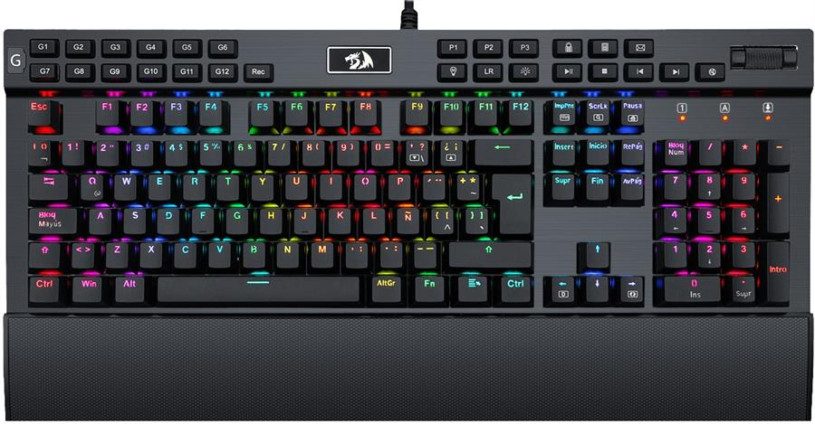

# Redragon Yama K550
## Layout:

## Programmable keys (G1 - G12)
The basic usage for the programmable keys is described on the manual and it's simple to follow:
1. Press "Rec".
2. Press one of the G keys.
3. Type the key sequence (Maximum 32 keys for 30 seconds).
4. Press "Rec" to save.

> Note: You can make the sequence play faster and in a constant rate if you press "Rec" two times on step 1 or even faster when pressing 3 times.

## Reset programmable keys (G1-G12)
Press and hold "Rec" for 5 seconds. [Reference](https://linustechtips.com/topic/770908-k550-yama-mechanical-gaming-keyboard-review-best-budget-board/)

## Programmable backlight color and animations
To save basic light profiles:
1. Press the desired profile (Keys P1-P3).
2. Press the key with the lightbulb and M inside.
3. Get stuck on that mode until you unplug the keboard from the PC and conect it again.

To save completly custom color layouts:
1. Press the desired profile.
2. Press "LR" key twice (All three indicator lights will start flashing), the key right below the escape ("°" or "|" key) will blink with the color selected.
3. Press all the keys you want on that color.
4. Switch colors with Fn + Right Arrow.
6. Get stuck on that mode until you unplug the keboard from the PC and conect it again.

## Reset color profiles (Because why not)
Option 1: Press Fn + Escape for more than 3 seconds.
Option 2: On Linux, use "OpenRGB" (It doesn't work, just deletes all your color profiles)
